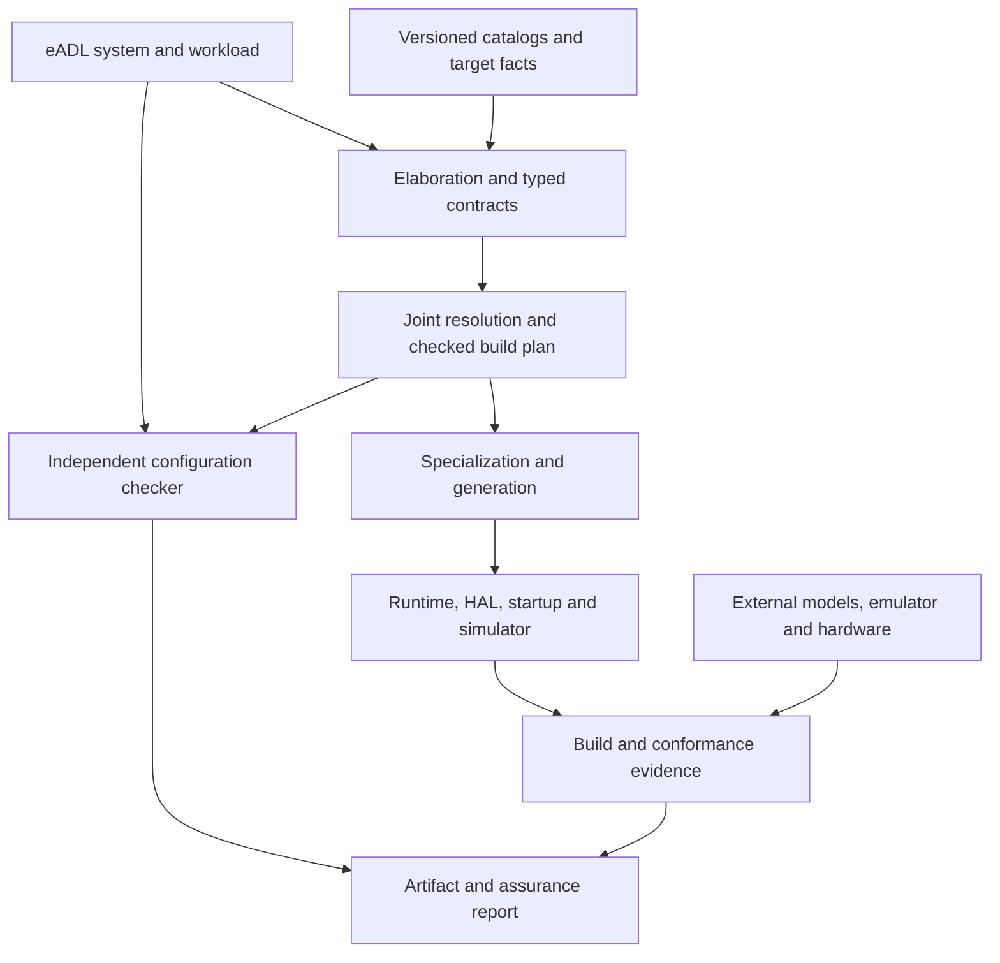

# eADL and OS Generation — Consolidated Roadmap

**Revised and corrected implementation roadmap — revision 2.0**  
**Date:** 2026-09-13  
**Status:** proposed execution baseline; implementation and assurance claims remain to be demonstrated.  
**Inputs:** the supplied `os-generation-roadmap.md`, the eADL project charter, the accompanying engine architecture diagram, the supplied Claude-session history, revision 1.0 of this consolidated roadmap, and Claude's subsequent review.  
**Purpose:** guide a Rust implementation from a bounded first system to a reusable OS-generation toolchain.

This is a standalone replacement for the original OS-generation plan. It incorporates the eADL charter and makes necessary amendments explicit. It does not claim that the existing eADL draft already specifies the additional semantics, tools, or proofs described here. Names of future crates, commands, schemas, and profiles are proposed interfaces, not existing software.

**Controlling boundary:** eADL describes hardware and OS features, functionalities, their externally required behavior, and constraints. It contains no implementation. Algorithms, device implementations, register-programming sequences, simulator models, implementation-provider selection, lowering rules, code layouts, and code generation belong to the engine and its knowledge bases. This boundary incorporates the user's clarification and takes precedence over ambiguous wording in the supplied drafts.

**Execution preferences carried forward from the session:** develop the architectural feature model top-down; keep the fictional playground as a permanent first-class target; make sub-hardware and sub-OS descriptions importable and composable; allow the language to grow using its own declaration constructs; use completion gates rather than invented calendar durations. A small independent reference implementation is a falsification control, not a prerequisite to designing the language or a source from which to reverse-engineer its architecture.

**Naming migration, 2026-09-13:** the toolchain's command and its component crates were renamed
`osgen` → `archogen`, matching the project. This affects §4.2's component names
(`archogen-plan`, `archogen-emit`, `archogen-check`) and every command in §10.2. It is a rename
only: no interface, semantics, or acceptance evidence changed with it. §15 requires renames to
carry a migration note, and this is it.

**Reading guide:** start with the [mission](#1-mission-and-first-result), [eADL/engine boundary](#4-system-architecture-and-responsibility-boundaries), [milestones](#12-phases-and-exit-gates), and [initial implementation queue](#18-initial-implementation-queue). The [correction table](#2-corrections-to-the-source-roadmaps) records departures from the drafts; the [acceptance matrix](#13-verification-and-acceptance-matrix) makes the gates concrete.

**Revision 2 changes:** the program architecture and functional eADL boundary are retained. Four targeted additions turn review observations into executable gates:

| Change | Location | Acceptance evidence |
|---|---|---|
| Worked feature/implementation boundary cases | §4.3 and M0 | F27: classify and explain representative declarations |
| Early executable generation path | S0 in §12 and package 3 in §18 | F28: tiny feature description generates a running artifact before the full foundation exists |
| Explicit timing cost accounting and repeated-preemption fixture | §7.4.1 and §13.4 | F29: exact event ledger, independent timeline, and omission/double-charge detection |
| Enforced trust-dependency inventory | §4.4 and §14.4 | F30: graph/source/feature drift blocks acceptance until reviewed |

S0 is an exploratory integration gate alongside early M0/M1 work. It is not a substitute for M4's complete generated system. The initial F01–F26 cases remain; F27–F30 supplement them. This is a new complete edition, so it can be read without keeping revision 1.0 open.

## 1. Mission and first result

Build a deterministic toolchain that turns eADL descriptions of a platform, workload, services, and policy into a complete specialized operating system, a matching development simulator, and a report stating what has been checked and under which assumptions.

The engine interprets the functional description, chooses implementations, and composes, specializes, and connects reusable Rust implementations and reviewed architecture code. It must support multiple materially different systems without manual edits to generated output. A language frontend, catalog, or single booting kernel alone does not complete the project.

The first supported family is a small, single-core, statically configured real-time executive. This is a deliberate initial profile. Broader OS functionality remains a long-term goal, admitted through additional profiles with their own contracts and acceptance evidence.

The first convincing result is:

1. Three distinct workload descriptions generate complete runnable systems from the same catalog release.
2. The systems run in a deterministic hosted environment and an independently implemented emulator; at least one also runs on a named physical target.
3. Invalid configurations fail with actionable explanations, including resource conflicts and unsupported assurance requests.
4. An independent checker validates the selected configuration and scheduling analysis inputs.
5. Each build carries explicit assumptions, implementation evidence, target evidence, and artifact hashes. Tests and conditional analyses are accurately labeled.
6. No user patches generated Rust, linker scripts, or startup code to make the declared examples work.

### 1.1 Meaning of “complete, no holes”

Every required implementation, application entry point, runtime service, architecture operation, and build input resolves to a declared, versioned source. Generated output contains no unresolved stubs, placeholder device semantics, or required post-generation edits.

Reviewed reusable Rust and assembly are legitimate catalog inputs. Generation may emit bindings, specialized code, tables, layouts, and copied or linked components. The percentage of emitted lines is not the definition of completeness.

Application algorithms are supplied through a separate engine build manifest that associates logical task names with source or artifact inputs. They are never embedded in eADL. The engine does not invent application bodies or device behavior from feature names. Experiments with algorithm or assembly synthesis are separate work items with separate acceptance criteria.

### 1.2 Design principles retained

- A common eADL description system for hardware and OS concerns.
- S-expression authoring, schemas, precise diagnostics, and source provenance.
- Reusable components with explicit assumptions and guarantees.
- Hosted deterministic development, fault injection, and replay.
- Independent checking before accepting a generated artifact.
- Explicit missing knowledge and refusal when required semantics cannot be established.
- Incremental language growth paired with a real consumer.
- Rust for the engine and primary runtime implementations.

The goal is useful generation with increasing assurance. Neither universal synthesis nor universal formal verification is assumed at project start.

## 2. Corrections to the source roadmaps

This table is the compatibility agreement between the OS program and the eADL program. Implementers must not silently retain a conflicting original rule.

Keep this table as a permanent decision record. If a correction later changes, append a dated rationale and migration consequence rather than removing the history and making the old claim appear valid again.

| Original position | Revised position | Consequence |
|---|---|---|
| One notation makes matching possible | eADL is the chosen frontend; shared semantics and linking make matching sound | Imports from other formats may lower into the same typed model |
| Capabilities form a partial order, therefore a lattice | Substitutability is a defined relation; a lattice is used only if its algebraic requirements are established | No lattice implementation is required for the first matcher |
| Match every requirement independently | Solve joint compatibility, allocation, topology, ownership, and provider constraints | Individually valid matches can still be globally infeasible |
| Hardware behavior is the chip designer's concern | eADL states offered functionality and its contractual meaning; detailed device behavior is engine knowledge | The engine supplies executable behavioral models |
| Generate a simulator from offered functionality | The engine maps the functional description to reviewed internal models | Missing engine knowledge is reported without requesting implementation in eADL |
| HAL and simulator agree by construction | Shared generation establishes consistency; external evidence checks shared mistakes | Independent reference semantics, emulation, and physical tests remain necessary |
| Schedulability checking proves the generated OS | A theorem applies to a workload model under assumptions; implementation and target conformance are additional obligations | Build reports separate these evidence categories |
| All extension must require zero core changes | Feature-language extension, engine knowledge extension, and engine semantic revision are distinct | New physics or properties may legitimately need engine work |
| All kinds are semantically unprivileged | Surface kinds can share the registry; a small trusted semantic foundation remains explicit | The registry cannot silently introduce new trusted axioms |
| Unknown capability anywhere blocks generation | Required facts in the selected dependency closure must be known | Irrelevant unknown facts do not invalidate unrelated systems |
| Requirements never name instances | Reusable services name categories; platform bindings may constrain actual instances and topology | Electrical wiring, affinity, reserved ownership, and security placement remain expressible |
| ISA semantics determine trap code | ISA semantics constrain code; ABI and kernel policies supply additional choices | Start with a reviewed substrate and generated layouts |
| Real silicon follows multicore and weak-memory expansion | An initial hardware target is selected and exercised early | Hardware evidence constrains language design before large expansion |
| A linear catalog growth curve proves failure | Measure marginal total engineering cost and reuse by component class | New device adapters can coexist with successful amortization |
| One-file agent tasks are the unit of correctness | A coherent contract change is the unit of review | Multi-file changes are allowed when the boundary requires them |

Description size can fall through exact reuse, parameterization, specialization, defaults, and optimization. Only the latter choices necessarily leave freedom to resolve. The RTL analogy is useful for separating descriptions, implementation libraries, target facts, and constraints; it does not imply that RTL requires one global clock or lacks legacy constraints.

## 3. Scope and supported profiles

### 3.1 Initial profile: `rt-static-up-v1`

| Concern | Initial decision |
|---|---|
| Processor | One active core; one execution context runs at a time |
| Scheduling | Static unique task priorities; preemption at the target's supported interrupt points; bounded kernel critical sections |
| Workload | Finite static task set; periodic or sporadic releases with declared minimum separation; constrained deadlines; bounded release jitter |
| Task execution | Separate statically allocated task stacks; bounded jobs; no self-suspension within a job |
| Resources | Static task and kernel objects; no runtime heap allocation; no application mutexes in the first profile |
| Communication | First release needs no general IPC; task-to-task queues require a later profile amendment with bounded semantics |
| Interrupts | Timer interrupt plus explicitly modeled bounded sources; unknown or uncontrolled interrupt load is unsupported for timing assurance |
| Time | Fixed clock configuration; explicit counter modulus, conversion rules, and interrupt delivery bounds |
| Isolation | Trusted application components in one address space; no claim of isolation from malicious tasks |
| Fault response | Defined overrun, unexpected-trap, stack-guard, and assertion failure policy; bounded diagnostic handling |
| Devices | Timer and minimal observable output first; no filesystem, network stack, DMA driver, or general virtio dependency |
| Runtime | Rust `no_std` core with narrow architecture and MMIO boundaries |
| Host support | Linux and macOS development first; Windows support after the primary pipeline works |

The scheduling model is fixed-priority even if the test harness randomizes event ordering at permitted boundaries. Test exploration must never change the policy whose timing is being analyzed.

The first profile excludes task migration, mixed-criticality scheduling, dynamic clock scaling, unbounded blocking, arbitrary asynchronous executors, dynamic task creation, and runtime-loaded drivers. A request for these features returns an unsupported-profile diagnostic rather than silently reducing the requested guarantee.

### 3.1.1 Fault classification, attribution and containment

**Amendment, 2026-09-13 (leaf `M2.9`).** §3.1's Fault response row names four faults and §8.1 names
three classes, and nothing connected them. Two independent implementations of §8 read the gap
differently — recorded, with both readings, in
`docs/decisions/decision_runtime-contract-gaps.md` — so the mapping is fixed here rather than left
to each implementer. This is an addition, not a correction: no earlier decision changes, and no
existing description or result is invalidated.

**Amendments, 2026-10-01 (leaf `M2.9`).** Two **correct** the 2026-09-13 text (findings §6 (a), (b)): a second
release latched in a masked region is contained, not fatal (rule 1), and a completion closes its region (rule 4).
The rest answer two independent reviews of this text, *R1* and *R2* below; every change that moved an
implementation is listed in `decision_runtime-contract-gaps.md`, *What changed an implementation*. No version of
`rt-static-up-v1` is released or locked (§15), so none is advanced.

**Terms.** A **masked region** is the interval in which the runtime's mask nesting depth is above zero: opened by
a job's outermost `mask`, kernel or application, and closed by the matching `unmask` or by that job's completion
(rule 4). A **section** is one `mask`…`unmask` pair inside a region; §3.1's "kernel critical section" is a region,
and the composition's "masked run" is a region's extent. The processor's own interrupt disable — in a service, the
trap path, a transition, the completion path, idle or the fatal handler — is **not** a masked region, and §13.4's
"latched" means pending in hardware there, not held in a task's latch. **Only a job changes the depth:** a `mask`
or `unmask` executed with no job running is an assertion failure of the executing context, and so is a depth above
zero when a job would start — raised by that decision, which is no task's. So every section open at a completion
is the completing job's. A task's **latch** holds the most recent release that arrived inside a masked region, and
a mark that an earlier one also did. A task **owes a job** from its release until that job completes or is
abandoned. An **unexpected trap** is any trap other than the timer's interrupt, a declared source's interrupt whose
claim finds a request, and the runtime API's own entry where the port uses one; a claim that finds no request is
one, since the composition's `no-empty-claim` makes it a port's broken obligation.

| §3.1 fault | §8.1 class | Attributed to | Containable |
|---|---|---|---|
| Overrun | Expected error | the **overrunning** task, whichever context holds the processor (rule 2) | Yes — by its declared per-task policy (§7.3, rule 5) |
| Stack guard | Violated internal invariant | the executing context (rule 2) | No |
| Unexpected trap | Deliberate fatal trap (its cause is outside the model) | the executing context (rule 2) | No |
| Assertion failure | Violated internal invariant | the executing context (rule 2) | No |

The rules below settle what the text left open; what is still open is listed at the end.
1. **Detection applies the policy.** An overrun is a fault the moment the runtime observes a release for a task
   that still owes a job; it does not wait for a separate decision. §3.1 requires the policy to be *defined* and
   §7.3 makes it part of the task record, so it is the system's behaviour rather than a caller's option. Every
   release that arrives while a masked region is open is latched, and is observed — for this rule and every other —
   only at its **delivery**, when the region closes. At delivery a task's latched arrivals are judged in arrival
   order against the task's state then: the first is fresh if the task owes no job (one that completed inside the
   region included) and an overrun if it does; the next is an overrun, because the first left a job owed; the
   earlier arrivals the mark stands for are judged as one. Across tasks the order changes no task's state and is
   the port's (`M2.15` traces it). So an overrun is not lost, nor fatal for landing inside a region rather than one
   instruction after it — for arrivals the platform delivers as distinct requests: a timer-released task's are
   computed at delivery and never coalesce; an externally released task's are distinct only where its source's
   record states that arrivals during a pending request are counted, and otherwise a port records that a second
   one in a masked interval, and its overrun, can be lost. The release that triggers an overrun is the policy's:
   under `SkipLateJob` it becomes the task's next job, the latched release with its nominal instant; under `Fault`
   it goes with the faulted task. A completion and a release at one instant: the completion first (§13.4).
   *(2026-10-01: §6 (b); R1 6, 14, 22; R2 31, 37, 42, 49.)*

   1a. **An overrun raised without a release is outside this profile.** `rt-static-up-v1` has no execution-budget
   monitor: an overrun is detected by rule 1 alone, as rule 6 says of a deadline. A port that raises one another
   way — a monitor's interrupt, or a bound checked synchronously — is outside the profile. A later profile that
   admits one must say how its source is declared (§3.1, §7.3) and charged, and how its overrun is judged against
   the job it measured. *(2026-10-01: R1 5; narrowed by R2 26, 27, 29, 40, for the director's review.)*
2. **Attribution follows the fault, not the processor.** An overrun is attributed to the overrunning task — the
   task a release, or a delivered latched release, belongs to — whichever context holds the processor: a task that
   is ready and not running, the task whose job the release service interrupted, or the task executing its own
   outermost `unmask` or completion. The single-core rule of §3.1 governs *execution*, not *attribution*. The other
   three faults are synchronous to the context executing the faulting instruction and are attributed to it. A
   task's job, including a runtime primitive or the completion path it called, is that task. A service, the trap
   path, a transition, idle or the fatal handler is no task: the evidence names that context, and records the task
   it interrupted as interrupted, never as attributed. A service or the trap path interrupts the task whose job it
   preempted, or none if it preempted idle; a transition interrupts the task the runtime holds as running when the
   fault is raised — the incoming one once the switch is decided, the outgoing one, or none, while it is being
   decided. A stack guard is attributed the same way, and the evidence names whose guard was hit — a task's, or the
   interrupt stack's. *(2026-10-01: §6 (d); R1 4, 8; R2 34, 46.)*
3. **A containable fault raised inside a masked region is not containable.** Two grounds:
   - terminating a job that *holds* the region leaves the nesting depth above zero with no owner, so interrupts
     never return; forcing the depth to zero re-enables them inside a region whose invariants the faulting job was
     partway through restoring;
   - and containment means **resuming the schedule** from a state the region had not finished making consistent,
     which is what a kernel critical section exists to prevent. That holds whichever task the fault is attributed
     to, not only the one holding the region.

   Ground 1 covers the task holding the region; ground 2 extends the rule to every task. §8.1 offers no third
   option — "preserve a defined fatal handler" — so it escalates (rule 7). Escalation is the conservative
   direction: a fatal path that was not strictly required costs availability, while a containment that was not
   safe costs correctness silently. In `rt-static-up-v1` no containable fault is raised inside a masked region —
   every release there is latched (rule 1), and there is no other way to raise an overrun (rule 1a) — so this rule
   decides nothing observable in this profile; it fixes the answer a later profile that admits one starts from.
   *(2026-10-01: §6 (e); R1 1, 24; R2 26.)* ⚠️ Delivery is **not** inside a masked region, so an overrun found at
   delivery applies its ordinary policy — the difference between a profile that can contain an overrun and one
   that cannot.

4. **A job may complete inside a masked region, and its completion closes it.** The region is the job's (Terms),
   so the nesting depth returns to zero with the job, and releases latched in the region are delivered after the
   completion is recorded and before any task executes an instruction of its own code. Whether the next scheduling
   decision precedes that delivery — the target: decided in the completion path, delivered when the following
   transition unmasks — or follows it — a hosted model — is the port's: both reach the same state, and `M2.15`
   states how a trace shows each. A completion is not a fault: the job's own code has finished, so neither ground
   of rule 3 reaches it, and it is the masked run that ends at completion, which the timing analysis charges
   (`docs/specs/catalog/decision_runtime-composite-inputs.md`, `CS_i`). A latched release is judged at that
   delivery (rule 1), so a task that completed inside the region is released afresh, not overrun. *(2026-10-01:
   §6 (a); R1 16; R2 30.)*
5. **The two overrun policies.** `SkipLateJob` (eADL `skip-late-job`): the task's owed job is abandoned — not
   started, preempted, or the job the release interrupted. Its remaining code never runs and no completion is
   recorded for it, no fault halts anything, and the triggering release starts the task's next job (rule 1).
   `Fault` (eADL `fault`): the task is faulted and leaves the schedule until reset. Its owed job is abandoned, the
   triggering release and every later release of it are discarded, and no further instruction of its own code runs;
   every other task continues, and the runtime does not halt. A task without an `on-overrun` clause has `Fault`, and
   `archogen check` refuses any other policy (`docs/semantics/model.md` §4 rule 6, leaf `M2.14`). A job is
   abandoned only where it holds no masked region: in its own code with the depth at zero, or at the entry or return
   of a primitive that leaves the depth at zero. A policy applied while the job is inside a primitive takes effect at
   the primitive's entry if the primitive has not yet changed the runtime's state — for `mask`, before the depth is
   raised — and otherwise at its return; under `Fault` the runtime completes or rolls back the primitive on the
   task's behalf, which is not the task's own code. Containment keeps the runtime's state consistent and the
   schedule running, and claims nothing about the application state the abandoned job left (§3.1, Isolation). A
   run's timing claims end at its first contained overrun, which shows that an assumption of its analysis — an
   execution bound, an arrival bound or the interference it counted — did not hold, or that the claim was not
   established. *(2026-10-01: R1 2, 11, 25; R2 28, 32, 41.)*
6. **The runtime detects no missed deadline.** Rule 1's overrun is its only timing fault. A missed deadline is
   observed only if the next release finds the job still owed — always with `D = T`, strictly periodic releases and
   zero jitter, the case §13.1 F26 exercises; any other miss is the analysis's to exclude and a trace's to observe.
   A deadline monitor would be a new source and a new fault. *(2026-10-01: R1 7, for the director's review; R2 39,
   40.)*
7. **Escalation halts, and keeps the first fault.** A fault that is not containable, or is made so by rule 3,
   enters the fatal handler. From then no job runs, no release is processed or latched, and no transition occurs;
   the handler ends, within a bound the runtime's catalog record declares beside the nesting bound `M`, in a
   terminal state with interrupts masked. It preserves until reset the **first** such fault only: its §3.1 kind,
   its §8.1 class, the attributed task's stable logical ID — its eADL task name, which `archogen check` requires
   unique (`schema-duplicate-name`) — or no task with the executing context, the task it interrupted, if any, and
   whether rule 3 escalated it. A runtime that records a task by an internal index records it with the plan that
   maps the index to the name (§7.5). A fault taken in the handler ends it at once in its terminal state and never
   replaces the preserved one. What the task table shows afterwards is the implementation's, and is not evidence of
   attribution. *(2026-10-01: R1 9; R2 34, 44, 48.)*

Two smaller decisions are fixed at the same time, for the same reason:

- **A task set must be non-empty** — no workload makes §7.2's second timing obligation vacuous. `archogen build` and
  boot refuse one; `archogen check` admits it, a system describing composition alone (F01) being valid (`M2.17`).
- **Kernel critical sections are bounded by a declared nesting depth.** "Bounded kernel critical sections" did not
  say what the bound is or what happens at it. Each runtime's catalog record declares a maximum depth `M ≥ 1`. A
  `mask` that would raise the depth past `M`, and an `unmask` at depth zero, are **assertion failures**: a counter
  that *wraps* re-enables interrupts inside a critical section while reporting success, one that *saturates* stops
  counting, and one that *refuses* leaves its caller's matching `unmask` to close the section early. This bounds
  the depth; the duration is bounded separately, by the `CS_i` the timing analysis charges. *(2026-10-01: R1 10; a
  refusal had been the answer.)*

**Still open:** each path's observation events and hosted/target trace compatibility (`M2.15`); and, needed by no
fixture yet, a later idle-to-task dispatch's cost and a periodic task's first release instant.

### 3.2 Three target environments

| Environment | Purpose | Limitation |
|---|---|---|
| `hosted-playground` | Fast deterministic testing of the shared runtime logic and explicit device models | Host execution speed provides no target WCET guarantee; simulated preemption covers defined boundaries |
| `riscv-virt-up` | Early execution of target binaries, startup code, interrupt paths, and MMIO contracts in independent QEMU | It is a virtual platform, not a physical board or a cycle-accurate timing reference |
| `board-first` | Exercise the same OS profile on a named physical processor and device revision | Selection and timing evidence must be documented before making hardware claims |

Use one RISC-V target width and explicit ISA feature set for initial emulator bring-up; match the first available suitable physical board where practical. M0 must name the exact board, processor revision, debug interface, memory execution region, clock configuration, and available specifications. If suitable RISC-V hardware is unavailable, record an explicit target decision rather than delaying all physical testing or pretending QEMU is hardware.

QEMU documents its `virt` platform as a virtual machine with configurable devices and a generated device tree. Pin the emulator configuration, inspect the produced hardware description, and verify agreement with the eADL platform fixture. Do not rely on changing defaults. [QEMU RISC-V virt documentation](https://www.qemu.org/docs/master/system/riscv/virt.html)

Board selection is a required first-milestone decision, not an open-ended research phase. Prefer accessible debugging, simple clocks, executable RAM, and documented timing-relevant behavior. A board that is useful for functional bring-up may still be unsuitable for strong timing guarantees.

### 3.3 Later profiles

Add bounded queues and one resource-sharing protocol first when required by real examples. Then consider protected tasks and a capability kernel, additional scheduling policies, multicore, DMA, dynamic power states, and POSIX personalities. Each changes a named profile and its analysis obligations. No earlier timing or isolation result automatically transfers to a new profile.

## 4. System architecture and responsibility boundaries



The checker uses the submitted requirements and resolved plan, rather than trusting only a summary emitted by the generator. Its parser, canonicalization, and any shared semantic code are declared trust dependencies. Independence does not require reimplementing every utility, but shared logic must not be hidden.

### 4.1 eADL owns the description foundation

The eADL project owns syntax, source locations, modules, schemas, kind registration, type checking, normalized contract representation, and extension/version rules. The OS program owns workload and runtime profiles, implementation catalogs, hardware providers, OS lowering, simulator composition, target execution, and assurance reports.

Use a shared Rust workspace initially to reduce integration overhead, with clear crate boundaries. Do not build a second incompatible parser or matcher inside the OS backend. If eADL already has code, adapt to its public representation through a versioned adapter and contract tests. This roadmap has inspected design documents, not an existing implementation.

An eADL requirement such as “provide preemptive fixed-priority task execution with these deadlines” describes required behavior. Choosing a bitmap ready queue, context-save sequence, timer adapter, interrupt routine, or Rust module is an engine decision. An eADL hardware declaration identifies available functionality; the engine's platform knowledge supplies the concrete access method. Neither a missing model nor an unavailable backend is repaired by inserting implementation into eADL.

| eADL describes | Engine decides and implements |
|---|---|
| Available timer functionality and required time-service properties | Counter extension, compare programming, interrupt handling, and simulator behavior |
| Task-execution functionality, priority semantics, and deadline constraints | Scheduler data structures, dispatch code, context saving, and cost analysis |
| Memory capacity and required protection functionality | Concrete layout, page/region tables where applicable, and privileged operations |
| Hardware connectivity and supported operating states | Drivers, initialization order, transition sequences, and state-dependent models |
| Reusable sub-HW/sub-OS feature compositions | Realization graph, provider bindings, generated Rust, and verification execution |

### 4.2 Logical components

| Component | Responsibility |
|---|---|
| `eadl-front` | Reader, modules, source spans, schemas, normalization |
| `eadl-model` | Typed declarations, units, contract IDs, resource graphs, profile definitions |
| `eadl-resolve` | Candidate enumeration, joint constraints, deterministic selection, explanations |
| `archogen-plan` | Complete provider bindings, application inputs, initialization graph, memory layout, build identities |
| `archogen-emit` | Rust bindings, specialization, tables, linker input, simulator wiring, provenance |
| `archogen-check` | Independently validate the resolved configuration and evidence relationships |
| `rt-analysis` | Scheduling analyses with explicit applicability conditions and arithmetic witnesses |
| `rt-core` | Shared runtime state transitions and policy implementations |
| `arch-*` / `device-*` | Reviewed architecture, MMIO, startup, and device implementations |
| `sim-*` | Event harness and versioned behavioral models |
| `xtask` | Repeatable builds, test tiers, evidence packaging, target execution |

These are responsibility names. Split into separate crates only when testing, dependencies, or trust boundaries justify the split.

### 4.3 Worked boundary cases: functionality versus implementation

The boundary is about the meaning of a declaration, not how technical its vocabulary sounds. A constraint on observable functionality can belong in eADL. The procedure used to satisfy it belongs in the engine. The author should not have to encode a device algorithm merely to describe an architectural feature.

For each proposed eADL field, apply three tests:

1. Does it state an offered feature, required functionality, architectural connection, operating condition, or externally testable guarantee?
2. Would the declaration remain valid for a different implementation with the same relevant functionality and guarantees?
3. Can its interpretation be stated without prescribing an algorithm, instruction sequence, code provider, data structure, or executable model body?

If the first answer is no, or the field prescribes the items in the third test, put it in engine knowledge/configuration instead. A concrete architectural identity or addressable region may legitimately constrain a platform; this is not permission to put its driver into the language. Ambiguous new fields require a worked classification case before adoption.

| Case | Appropriate eADL feature or requirement | Engine-owned implementation and evidence |
|---|---|---|
| Time horizon | “Time observations must be unambiguous across at least 60 seconds,” or an offered modular-counter width/rate where architecturally relevant | Wrap handling, epoch extension, read frequency, arithmetic, and proof that the requirement is met |
| Atomic observation | “A counter observation must not combine inconsistent halves” | Native read, high/low/high retry sequence, synchronization, or firmware access |
| Deadline delivery | “An absolute-deadline service with a specified supported horizon and delivery bound” | Comparator programming, delay-to-deadline adapter, acknowledgment and race handling |
| Power availability | “This time service remains available in the declared idle state” | Power sequencing, clock-source switching, state-machine model, and validation procedure |
| Access authority | “This function is available at the required privilege or through an allowed mediation boundary” | Trap path, firmware ABI, privileged instructions, and capability-check code |
| Scheduling | “Static-priority preemptive task execution with these task constraints” | Ready-queue data structure, dispatch algorithm details, save/restore code, and cost charging |
| Ordering and coherence | Architecturally offered coherence or an externally required ordering guarantee | Barriers, cache maintenance, buffer synchronization, and executable memory/device models |
| Representation units | Declared units and acceptable ranges at the architectural interface | Scaling, rounding implementation, conversion helpers, and overflow checks |

In particular, a wrap limit or atomic-read guarantee is not automatically an implementation detail. Conversely, asking eADL authors to write the rollover algorithm or retry loop would cross the boundary. Native access atomicity may be a fact in engine platform knowledge, while the required coherence of the exposed observation is an eADL contract. Keep that distinction explicit when both are relevant.

M0 creates `docs/decisions/eadl-boundary-cases.md` and paired accepted/rejected examples. F27 tests schema rejection of forbidden implementation fields and correct interpretation of accepted cases; human review still checks semantic intent because a field can hide an algorithm behind an innocent name. Re-run the classification review when introducing a new kind or feature family. Do not add implementation syntax as an escape hatch for missing engine support.

### 4.4 Mechanical trust-dependency inventory

For each generator, configuration checker, scheduling checker, and reference-model build, emit a machine-readable dependency/provenance inventory. Root it in the actual build manifest and record the toolchain, host/target, feature set, source hashes, normal/build dependencies, procedural macros, and relevant generated/native inputs. Record shared model or fact sources as well as shared code.

Cargo's resolved metadata is a practical graph input; its format and target/feature selection must be explicit. A dependency graph is not by itself an exact account of everything compiled or executed. Complement it with build configuration, relevant build-script/generated-source inputs, and externally invoked tools; declare any conservative over-approximation or missing coverage. [Cargo metadata documentation](https://doc.rust-lang.org/cargo/commands/cargo-metadata.html), [Cargo build scripts](https://doc.rust-lang.org/cargo/reference/build-scripts.html)

Derive the reachable dependencies for each root and identify their intersections. Classify shared items as infrastructure, interpretation/normalization, semantic/analysis logic, authoritative data, or reference derivation. Emit `trust-dependencies.json` and a human-readable change report with the artifact package. Bind the report to the exact build and source identities it describes.

Compare against a versioned reviewed baseline. Newly shared items, new relevant dependency edges/features, or changed source content in an approved shared item require review of the affected claim. A checker acquiring a dependency on the generator's constraint-evaluation implementation must be visible and block automatic acceptance until its loss of independence is explicitly addressed. Merely auto-updating the baseline is not acceptance.

Different crate names do not establish independent derivation. Copied code, shared generated formulas, and common source misinterpretations still require provenance and review. This check enforces disclosure and change control; it does not prove semantic independence.

## 5. eADL semantics required by OS generation

### 5.1 Description kinds and modules

Retain `defblock`, `defplatform`, `defservice`, `defpolicy`, and `defsystem` as functional declarations. `defpolicy` expresses required policy behavior, such as priority or isolation rules; it does not select Rust algorithms or code providers. Add workload requirements through an `os/rt` feature module. Their exact surface spelling is settled by M1 fixtures. Keep implementation and evidence metadata in separate engine records.

| Concern | Required information | Consumer |
|---|---|---|
| Workload requirements in eADL | Logical tasks, release behavior, priorities, deadlines, functional resource needs | Engine planning and scheduling analysis |
| Hardware functionality in eADL | Available feature categories, capacities, functional topology, operating constraints | Engine matching and platform validation |
| OS requirements in eADL | Services, externally observable semantics, required policy behavior | Engine realization and checking |
| Assurance requests in eADL | Property to establish and required assurance, expressed declaratively | Engine analyzer selection and acceptance |
| Implementation records in the engine | Preconditions, algorithms, code, dependencies, target adapters, allocations, initialization | Resolver and generator |
| Behavioral and timing models in the engine | Device state machines, protocols, costs, analytical models | Simulator composition and conformance |
| Evidence and application inputs outside eADL | Source/artifact identities, task-code association, bounds and their evidence, hashes | Engine build manifest and assurance report |

All semantically meaningful fields need a consumer. Descriptive annotations are permitted when explicitly marked non-semantic and excluded from correctness claims. Annotation changes do not masquerade as implementation progress.

### 5.1.1 Composition and functional refinement

An eADL system imports reusable sub-HW and sub-OS descriptions with namespaces, explicit exports, typed parameters, and version constraints. Instantiate a module more than once without sharing mutable elaboration state. Diagnose circular imports, conflicting exports, contradictory requirements, and incompatible feature versions.

Composition combines architectural functionality, logical connectivity, and constraints. It does not inline implementation bodies. Platform descriptions may identify concrete blocks, routing, addressable regions, and architectural parameters when these are externally relevant facts; device-register programming and their concrete realization still belong to the engine. Service modules depend on functionality rather than a hard-coded driver identity.

Refinement permits a more concrete architectural description to satisfy an abstract functional description. The engine checks the relevant guarantees, operating conditions, capacities, topology constraints, and negative requirements. A refinement declaration is an obligation to check, not permission to trust a claim blindly.

The language can be concise for standard compositions and explicit for unusual feature constraints. Readability is tested on imported systems and failure diagnostics, not only on tiny examples.

### 5.2 Capabilities and substitutability

Define an offer as a contract over observable behavior and admissible use. An implementation can satisfy a requirement only if it accepts the required operating conditions and guarantees the required behavior. Stronger preconditions are not silently accepted as stronger capabilities.

For parameter-only contracts, implement explicit matching rules in a decidable fragment: enumerations, booleans, bounded integers, rational quantities with units, intervals, finite sets, and restricted arithmetic. Cross-field implications must be declared. Each parameter has a documented comparison direction and any required normalization.

More bits or a faster clock is not universally better. Timer substitutability can depend on wrap interval, read atomicity, programming range, power state, access privilege, and output units. These are distributed between externally stated architectural guarantees and engine platform knowledge according to §4.3; this section does not require implementing their behavior in eADL. A faster wrapping counter can violate a minimum unambiguous time-horizon requirement. An adapter that rescales, extends epochs, or translates deadlines is a real provider with costs and proof obligations.

Do not call the relation a lattice without establishing the required algebraic properties. General theorem proving over arbitrary extension code is outside the initial matcher.

### 5.3 Presence, relevance, and contradictions

Maintain offered, explicitly absent, and undescribed states for facts in a versioned capability vocabulary. “Offered” records a claim whose evidential status is separate; declaring it does not make it proven.

Compute the transitive dependency closure of the requested services, provider preconditions, target bindings, and requested analyses. Unknown facts inside that closure block the relevant decision. Unknown facts outside it remain visible in metadata and do not fail generation.

Reject contradictory declarations rather than choosing one. Platform refinement must preserve the obligations actually relied upon by the profile, including relevant negative constraints; adding an unused device is not automatically an invalid refinement. New vocabulary does not silently change the meaning of an old locked system.

### 5.4 Joint allocation and provider resolution

The resolver must consider the whole selected system:

- Compatibility of observable contracts and units.
- Exclusive versus shared resources and finite capacity.
- Device connectivity, interrupt routes, privilege, and memory placement.
- Provider dependencies, bundles, conflicting ownership, and initialization order.
- Lifetime rules and supported execution contexts.
- Analysis applicability after selecting providers, not just before selection.

For example, matching two independent requests to one exclusive comparator is invalid unless a selected multiplexing service supplies the required semantics and bounded overhead. Choosing firmware control for one operation and direct control for another is invalid when the two cannot safely coexist.

Start with finite candidates, deterministic backtracking and constraint checking. Introduce SAT/SMT only for a measured need and record its role in the trust boundary. A separate checker re-evaluates the returned complete assignment against the original normalized requirements. A solver timeout is not a proof of infeasibility.

Resolve feasibility before optimization. The first engine selection policy is explicit preferred-provider order with stable tie-breaking, stored in engine configuration rather than eADL. eADL may express functional or resource objectives without prescribing the implementation. Later cost optimization requires target-specific cost evidence; source line counts are not runtime latency estimates.

Engine search may realize an OS feature indirectly from lower-level hardware functionality. A software deadline service can use a supported relative timer through an engine-owned adapter, provided the resulting behavior and bounds satisfy the eADL requirement. Direct hardware offer matching is only one realization path. If no known realization exists, explain the missing engine capability; do not declare the requested function logically impossible unless that conclusion has actually been established.

### 5.5 Diagnostics

| Result | Meaning |
|---|---|
| `invalid-description` | Malformed, contradictory, or ill-typed input |
| `missing-fact` | Relevant contract information is unavailable |
| `unsupported-profile` | Requested behavior or analysis lies outside implemented semantics |
| `infeasible-configuration` | Supported constraints have no satisfying assignment |
| `analysis-inconclusive` | Resource limit, unresolved bound, or checker uncertainty prevents a conclusion |
| `not-established` | A sufficient analysis did not establish the requested property |
| `counterexample` | A validated witness violates a named property in its stated model or target execution |
| `tool-failure` | Internal failure or unavailable required tool; never reported as a valid system |

Each diagnostic carries source spans, the relevant requirement and offer IDs, the supported profile, a small explanatory conflict set where available, and a concrete repair direction. A conflict explanation need not be a mathematically minimum unsatisfiable core.

### 5.6 Extension and semantic stability

1. **Feature-language extension:** new vocabulary or composite functionality is expressed through eADL's own declaration facilities. It describes functional meaning, fields, and constraints, with no algorithm or code-generation instructions. If its meaning is already supported, the existing engine can consume it through its current interpretation rules.
2. **Engine knowledge extension:** new implementations, device models, feature-realization rules, or analyses are added to versioned engine catalogs or plugins. These records own lowering and implementation, even when they are stored in a declarative engine-specific format.
3. **Engine semantic revision:** new observations, execution rules, or property classes require reviewed changes to the engine's foundation and compatibility tests.

The initial `defkind` facility defines feature declarations and well-formedness. It must not become a host-code evaluator or an implementation template language. Its use of the same syntax as other declarations does not make new functionality executable without corresponding engine knowledge.

The engine uses typed internal representations for interpreted requirements, bound systems, runtime plans, and code emission. These are engine implementation structures. Their existence does not expose implementation in eADL.

## 6. Hardware models and simulator generation

### 6.1 Four separate layers

| Layer | Examples | What it enables |
|---|---|---|
| Architectural contract | Deadline source, counter modulus, privilege, coherence relation | Matching and software assumptions |
| Access description | Addresses, widths, access permissions, reserved bits, read/write effects | Safe register APIs and layout validation |
| Behavioral model | Pending interrupts, acknowledgment, wrap, reset, ordering, state transitions | Executable simulation and driver protocol tests |
| Timing model | Access costs, delivery latency, clock error, interference envelopes | Conditional timing analysis and target validation |

eADL describes features and the required or offered functionality at the architectural contract level. It does not describe gates, pipelines, device state-machine implementations, or coherence algorithms. The engine maps that description to the detailed access, behavioral, and timing knowledge needed for generation. Executable model code lives in engine catalogs and is selected by the engine.

For example, eADL can require a monotonic time service that remains available in an allowed power state. Counter rollover handling, register-read protocols, interrupt acknowledgment, and the implementation of epoch extension are engine responsibilities. Their correctness is checked against the feature's external contract.

CMSIS-SVD supports structured register descriptions and selected access effects. Importing such descriptions is useful, but a complete device simulator also needs protocol and state-transition semantics that may require additional sources and reviewed model code. [CMSIS-SVD register semantics](https://arm-software.github.io/CMSIS_5/SVD/html/elem_registers.html)

### 6.2 Minimum timer contract

Specify positive clock frequency, counter modulus, atomic-read method, conversion and rounding, maximum programmable horizon, past-deadline handling, compare-update races, interrupt level/edge behavior, masking and acknowledgment, clock-state dependencies, and ownership.

A finite hardware counter is modular, not globally monotonic forever. A monotonic logical clock requires explicit wrap handling or an operating horizon. For a delay-only timer, an absolute-deadline adapter must account for the time between reading “now” and completing programming, including bounded interrupt delay and already-expired deadlines.

### 6.3 Simulator scope and independence

The first generated simulator is a composition of device models and a deterministic event harness that executes the shared runtime logic. It is not a newly synthesized full CPU emulator. Arbitrary instruction-level preemption, architectural exceptions, and target MMIO paths are exercised by an independent emulator and later the board.

Define observation events: task release/start/preempt/resume/complete, timer programming, interrupt pending/entry/exit, fault, and selected MMIO interactions. Define which events and orderings a model allows, including underspecified hardware choices. Differential comparisons use compatible observable behavior, not unconditional byte-for-byte trace identity across all targets.

Reproduction captures input hashes, model and engine versions, event ordering rules, initial state, seed, recorded external events, and the trace. A seed alone is insufficient when any of these change. Preserve a minimized failing trace as a regression fixture.

The reference model must be independently derived where errors would otherwise be shared. Sharing syntax, constants, or a schema is recorded; sharing the same buggy transition function is not independent behavioral validation. QEMU and hardware can also be incomplete or faulty, so disagreements are investigated rather than settled by majority vote.

## 7. Assurance model and analysis

### 7.1 Claims attach to named properties

The report contains separate statuses for configuration validity, runtime functional behavior, timing, memory bounds, startup behavior, and any future isolation property. One global “verified” flag is prohibited.

| Evidence category | Example | Permitted conclusion |
|---|---|---|
| Structural check | Bound resources fit the declared platform | The checked configuration satisfies those constraints |
| Conditional analysis | Response-time bounds derived from supplied execution bounds | Deadlines follow in the declared model under listed assumptions |
| Tested conformance | Runtime traces agree with the reference for tested scenarios | No violation was observed within recorded test coverage |
| Model proof | A state-machine invariant is machine checked | The invariant holds for the stated formal model |
| Implementation refinement | A named implementation preserves a specified model property | That property transfers through the proved refinement and its assumptions |
| Target evidence | Binary-specific bounds or measured hardware behavior | Only the documented bound or observation applies to that target configuration |

Testing does not become proof through repetition. A published algorithm proof does not automatically verify its Rust implementation. A declared capability does not constitute hardware evidence.

### 7.2 Three obligations for timing

1. The selected scheduling theorem and its checker are valid for the admitted task model.
2. The runtime, selected services, and generated configuration conform to that model, with an explicit evidence level.
3. Execution, blocking, interrupt, and hardware timing bounds cover the concrete binary and operating conditions.

The first practical release may provide conditional analysis plus tested implementation conformance. It must list the unproved links. Stronger hardware timing claims require closing the corresponding gaps rather than renaming the report.

The separation is supported by the timing-analysis work around seL4, which treats processor timing, binary WCET, and system schedulability as distinct work. [Trustworthy Systems timing project](https://trustworthy.systems/projects/RTA/)

### 7.3 Workload and evidence inputs

For every task the engine assembles a complete record: stable logical ID, application entry point, priority, period or minimum inter-arrival time, relative deadline and its reference event, maximum release jitter, execution bound, stack allocation, resource use, allowed OS calls, and overrun behavior. eADL supplies the functional requirements and constraints. The separate build manifest supplies application-code associations and evidence; the engine derives concrete allocations and other implementation fields.

For every interrupt source record arrival assumptions, maximum service cost, priority, masking constraints, and whether interrupt nesting is possible. No source that can run during the analyzed interval is omitted just because it belongs to the kernel or instrumentation.

Every numerical bound records units, origin, scope, target and binary identity, and evidence category: assumed, observed maximum, externally supplied bound, or analytically established bound. An observed maximum with a safety multiplier remains an empirical assumption unless a valid argument establishes a bound.

### 7.4 Initial scheduling checker

Implement a deliberately restricted mathematical baseline first: one processor, independent preemptible tasks, distinct fixed priorities, no release jitter, no blocking, no overhead, constrained deadlines, and declared worst-case computation times. Under that model the standard response-time iteration is:

\[
R_i^{(0)} = C_i,\qquad
R_i^{(k+1)} = C_i + \sum_{j\in hp(i)}\left\lceil\frac{R_i^{(k)}}{T_j}\right\rceil C_j.
\]

Here `hp(i)` is the set of higher-priority tasks, `C` is computation time, and `T` is minimum release separation. Use exact integer time units or checked rational arithmetic, upward rounding where needed, overflow detection, and explicit convergence/deadline limits. Record the recurrence sequence as a checkable witness.

This baseline is for validating arithmetic and theorem implementation. It must not be selected for a physical runtime whose nonzero overhead and jitter are omitted. Before accepting `rt-static-up-v1` timing results, M1/M2 must implement and review an analysis variant that accounts for its bounded critical sections, release jitter, timer/other interrupt interference, and context-switch costs. Document how every cost is charged so that none is omitted or double-counted. Conservative analysis failure is `not-established` unless an exact test or validated counterexample establishes failure.

Use published analysis as the reference, with reviewed applicability conditions and independently obtained expected results. Cross-check with an external tool only after aligning model semantics and units. [Audsley et al., Applying New Scheduling Theory to Static Priority Pre-emptive Scheduling](https://www.cs.york.ac.uk/rts/publications/Audsley1993.html)

### 7.4.1 Explicit cost-accounting contract

Each admitted runtime analysis has a versioned cost-accounting contract. It identifies the timing observation boundary, what task execution bounds include, how releases become ready, which operations are preemptible, the number and kind of context transitions, interrupt arrival/service assumptions, and any dispatch, critical-section, instrumentation, or idle/wakeup costs.

Every physical execution interval in a fixed trace has one primary ledger category. For example, do not count the same interrupt entry instructions once in an ISR term and again inside a context-switch term. If a measured WCET already includes dispatch or interrupt work, record that inclusion before combining it with other costs. Charge only mutually disjoint intervals when asserting exact totals.

For analytical upper bounds, conservative over-counting may be intentional: independently maximizing mutually exclusive paths can overestimate total cost. Document that conservatism separately. The requirement is no *undocumented* omission or duplicate charge, not a ban on sound pessimism. Distinguish exact trace accounting, safe analytical envelopes, and observed maxima.

M2 implements the repeated-preemption fixture in §13.4 through both an independently specified event timeline and the engine's accounting path. A separate control tests removal of interrupt costs, omission of return/resume transitions, and duplicate costs already included in task bounds. F29 requires detection at the ledger or claim boundary; it must not demand an exact response-time answer from an intentionally conservative general analyzer.

### 7.5 Connecting a build to its analysis

The generator produces a resolved plan containing task parameters, priorities, resource assignments, stack allocations, selected provider IDs, and analysis inputs. The configuration checker validates that plan against the submitted requirements.

The build records the exact plan hash in generated metadata, checks linker placement and table contents, and records the resulting binary hash. Tests compare runtime observations with the plan. These checks strengthen traceability; matching hashes alone do not prove that the binary implements the scheduling policy.

Formal implementation refinement is a later, explicitly budgeted track. Until it exists, the report identifies the compiler, linker, runtime implementation, architecture substrate, and hardware models as relevant trust assumptions. seL4's published proof assumptions illustrate why these boundaries must be stated, even in a mature verified system. [seL4 proof assumptions](https://sel4.systems/Verification/assumptions.html)

### 7.6 Memory and stack evidence

Statically check actual linked sections, task stacks, interrupt stack, alignment, guards, reserved device memory, and kernel tables against the available memory map. Linker accounting can establish allocated capacity; it does not establish maximum stack usage.

Stack bounds require bounded call behavior, interrupt nesting rules, compiler effects, and evidence for relevant application code. Dynamic high-water marks are observations. If a static bound is unavailable, label the stack claim conditional and retain explicit guard/fault behavior. Reject recursion or other unsupported call patterns for a profile requesting established stack bounds.

## 8. Runtime and architecture substrate

Keep `rt-core` small and usable in hosted tests and target builds. Separate policy state transitions from the execution substrate. A hosted harness can inject preemption at modeled boundaries; the architecture port must also validate real asynchronous interrupt entry, context preservation, and return.

Initial mechanisms are static task creation at boot, a fixed-priority ready structure, release/timer management, interrupt dispatch, context switching, static memory layout, and a bounded fault path. Use the simplest bounded structures adequate for the profile. Do not add a generic object manager, reference counting, or an asynchronous service framework without a workload that needs them.

### 8.1 Unsafe boundaries

- Deny unsafe code by default; permit it in explicitly reviewed architecture, MMIO, and narrowly justified low-level modules.
- Review safety contracts across the full safe API, not only inside each `unsafe` block.
- Use distinct types for physical addresses, virtual addresses where relevant, MMIO regions, task IDs, priorities, and time units.
- Specify alignment, endianness, validity, ownership, and lifetime at ABI boundaries. A byte-casting library is a tool, not a blanket justification for all boundaries.
- Keep conditional compilation near target adapters, without an arbitrary one-file limit that encourages hiding necessary distinctions.
- Model synchronization and interrupt masking explicitly. Banning a mutex type does not eliminate races or blocking.
- Distinguish expected errors, violated internal invariants, and deliberate fatal traps. Avoid unchecked panic paths in normal runtime operation; preserve a defined fatal handler and diagnostic evidence.

### 8.2 Assembly and low-level generation

Start with reviewed startup, trap entry/exit, context switching, and privileged access routines. Generate context layouts, offsets, vector tables where applicable, and repetitive instruction sequences only from explicit contracts.

The ISA model constrains architectural effects. Additional inputs include the selected ABI, stack policy, interrupt nesting, register preservation, optional floating-point/vector state, privilege rules, and compiler configuration. The official RISC-V Sail model supplies ISA semantics; it is not by itself an OS entry-code synthesizer. [RISC-V Sail model](https://github.com/riscv/sail-riscv)

Test register patterns across repeated preemption, exception paths, stack alignment, startup initialization, and the supported privilege transitions. Track architecture-specific code size and review burden as metrics. Exceeding a line budget triggers architectural review, not an automatic deletion or unsafe generalization.

## 9. Catalogs and evidence provenance

Preserve the original four knowledge categories and make implementation and evidence responsibilities explicit.

| Catalog | Initial contents | Admission evidence |
|---|---|---|
| Algorithms and runtime components | One scheduler, timer manager, static object layout, interrupt dispatch | Contract, reviewed source basis, reference behavior, implementation tests, supported analysis model |
| Machine and ABI facts | One ISA/ABI configuration, startup and context rules, target memory model | Primary specification references, exact revisions, reviewed extraction, executable checks where possible |
| Device facts and models | Timer, interrupt route, minimal output device | Access schema, observable behavior, executable model, driver, independent conformance evidence |
| Interface and workload semantics | Internal runtime API, task lifecycle, fault semantics | Versioned API, model tests, valid/invalid examples; POSIX stays later |

Each entry needs an ID, semantic version, content hash, source/license metadata, maintainer, dependencies, supported profiles, preconditions, guarantees, implementation source, model source, cost evidence, and evidence status. Unknown or unreviewed data may exist in an experimental namespace but cannot silently satisfy a stronger production claim.

Behavioral and timing models may have separate versions because their changes invalidate different claims. Any bound tied to a binary is invalidated by an applicable code, toolchain, linker, feature, or target change. Dependency-based invalidation must identify affected builds and analyses.

Agents can help extract candidate facts, translate algorithms, and generate test cases. Extraction output is a proposal with a source location, not automatically an accepted fact. Independent reviewers check preconditions and any interpretation on which correctness relies. Cross-validation investigates source conflicts rather than averaging them.

## 10. Lowering, builds, and the user contract

### 10.1 Pipeline

1. Parse and expand the locked eADL modules with bounded deterministic expansion.
2. Type-check quantities, references, contracts, workloads, and profile membership.
3. Resolve resources and providers jointly; produce explicit bindings and assumptions.
4. Independently check the bound configuration and supported analysis applicability.
5. Lower to a runtime/build plan with initialization dependencies and memory allocation.
6. Emit and assemble the specialized runtime, target bindings, startup input, and simulator composition.
7. Build with pinned toolchain and dependencies; inspect actual linked output.
8. Run applicable conformance and target checks; compute property-specific report statuses.
9. Package the outputs, traceability, evidence, limitations, and reproducibility instructions.

Every pass has a typed input/output contract and validation rules. Retain intermediate dumps at useful boundaries. Provenance maps generated declarations and code spans to source forms, catalog entries, provider selections, and relevant assumptions; literal per-line comments are optional.

### 10.2 Proposed CLI

The following commands are an interface target to implement, not commands that exist today:

```bash
archogen check examples/periodic-three/system.eadl --profile rt-static-up-v1
archogen resolve examples/periodic-three/system.eadl --locked --out build/plan.json
archogen build examples/periodic-three/system.eadl --locked --out build/periodic-three
archogen analyze build/periodic-three --property deadlines
archogen verify build/periodic-three --tier emulator
archogen explain build/periodic-three --requirement timer.deadline
archogen replay artifacts/failure/replay.json
```

Separate source acceptance, build success, conditional analysis, test results, and requested assurance. A build may be useful for experimentation even when stronger assurance is unavailable. An explicit assurance request fails if required evidence is missing; it is never quietly downgraded to “tests passed.”

### 10.3 Build outputs

| Output | Required contents |
|---|---|
| Source/build package | Generated Rust, selected reusable sources or locked references, separately supplied application inputs, linker/startup inputs, build instructions |
| Executable | ELF and target loading image where applicable; debug information and memory map |
| Simulator | Model selection, configuration, event policy, and executable harness |
| Resolved plan | All bindings, resource ownership, task parameters, initialization order, selected profiles |
| Lock data | eADL/module/catalog versions, source hashes, compiler/linker configuration, target and emulator settings |
| Report | Per-property result, assumptions, evidence scope, unresolved obligations, artifact hashes |
| Debug artifacts | Source map, symbols, trace schema, test/replay manifests |
| Trust inventory | `trust-dependencies.json`, build/source identities, shared dependencies and data, reviewed-baseline delta, and coverage limits |

Builds do not call an LLM or fetch new semantic knowledge to resolve missing inputs. Online dependency acquisition is a separate explicit operation. Locked builds fail on missing or mismatched inputs.

Generate into a dedicated output directory. User customization belongs in descriptions or catalog inputs. Reproducibility means identical semantic plans and deterministic generated sources from locked inputs; binary reproducibility is additionally tested in the same pinned build environment, with unavoidable differences identified rather than ignored.

### 10.4 Programmatic interface

The CLI in §10.2 is the human interface. The same operations are also exposed programmatically, so a
machine consumer — a browser, an editor, a build farm, another toolchain, or an agent — can drive
archogen without a shell and without parsing prose. Added by director ruling 2026-09-28; recorded in
`docs/decisions/decision_programmatic-interface.md` and owned by the `API` task tree.

**One declared engine API, and the CLI is a consumer of it.** The API takes a description as text plus a
profile and returns a structured result. It is transport-neutral: the command line, the wasm binding and
the MCP server are three consumers of one contract, not three implementations of it. A capability that
exists only behind the CLI does not exist programmatically, and the reverse.

**Bindings.** A `wasm32-unknown-unknown` build, so the description-side toolchain runs in a browser or a
worker; and an MCP server, so any agent — an LLM, a swarm, an orchestrator — can drive a running archogen
instance. The server is a capability of the built binary: it is spawned per instance and listened to, and
its tool list is derived from the same command table the CLI help is derived from, so a documented
operation is always an offered one, and an unimplemented one names the leaf that owns it rather than
failing at runtime.

**Both builds are outside the programmatic interface.** Neither the compilation of archogen itself nor
`archogen build` (system generation, §10.3) is controllable through it. Generation writes a crate tree
and is a human or CI action; exposing it would give a remote consumer a filesystem authority the rest of
the surface does not need, and would end the property that makes the surface safe to hand to an arbitrary
agent. `archogen verify` runs verification tiers, which invoke a toolchain and an emulator, and needs the
same ruling before it is exposed; it is not exposed by analogy.

**The evidence vocabulary crosses the boundary unchanged.** Every programmatic response carries §5.5's
verdict for what it reports. A result returned without its verdict is not a result: it is how
`tool-failure` or `analysis-inconclusive` becomes `established` in a consumer that never saw the
distinction. §7.1's rule — no report renders while a named property is unanswered — applies to a
machine-readable response exactly as it applies to a printed one.

**Trust and dependencies.** The engine crates stay dependency-free (§4.4). A transport crate may take an
external dependency only through a decision record naming its §4.4 trust category and the claims its
compromise would invalidate, and that dependency must be reachable from the transport and not from the
generator or the checker: a serializer shared between the engine and its reporting surface is precisely
the loss of independence the F30 gate exists to surface.

**Sequencing.** Declared after the M1 language freeze (§12 M1, §15). An API over an unfrozen language is
an API that will break, and a freeze is what makes declaring one worth the cost.

## 11. Workstreams and integration ownership

| Workstream | Owns | First integration |
|---|---|---|
| A — Functional model and eADL | Feature vocabulary, composable descriptions, profile semantics, reader and schema facilities | M1 typed playground and workload descriptions |
| B — Engine and realization | Internal contracts, provider search, allocation, lowering, generation | M3 checked complete engine plan |
| C — Knowledge bases | Algorithm implementations, machine/device facts, simulator models, source provenance | M2 one complete scheduling/timer realization |
| D — Verification and evidence | Independent models, configuration checker, timing analysis, claim reporting | M2 externally anchored analysis and counterexamples |
| E — Target execution | Hosted execution, emulator, board, startup, ABI, interrupt and MMIO checks | M2 early target spike; M4 generated target execution |
| F — Engineering operations | CI tiers, dependency locks, repeatable builds, review boundaries, regression tracking | M0 workspace and task/review contract |

An integration owner runs S0 alongside early functional modeling, before M1–M3 infrastructure is complete. The early executable is deliberately tiny and revisable; its fixtures preserve what was learned about input-to-output behavior.

The functional model leads. Independent reference work runs alongside engine development to challenge assumptions. Workstreams integrate through small fixtures and checked interfaces. They are not six teams expected to disappear independently and integrate at the end.

Each milestone has an owner for integration and a separate reviewer for its claimed evidence. Agents can implement bounded work concurrently where contracts are stable. No claimed fixed agent speedup is built into the plan.

## 12. Phases and exit gates

There are no calendar durations. A phase exits on evidence. S0 introduces a small executable generation path as soon as one feature slice is written, without waiting for full M0 target decisions or M1–M3 foundations. Other spikes for later risks may start earlier; promotion of a supported feature requires its prerequisites. Hardware work begins early while the playground remains the primary rapid-development target.

| Milestone | Main dependency | Result |
|---|---|---|
| M0 — Charter and examples | This roadmap | Agreed boundary, target selection, fixtures, trust/evidence vocabulary |
| S0 — Early executable generation | Minimal M0 feature slice; runs alongside M0/M1 | Tiny description to generated, compiled, executed artifact |
| M1 — Functional descriptions | M0 | Typed, composable eADL descriptions without implementation content |
| M2 — One complete engine realization | M1 semantic slice; target spike starts at M0 | Scheduler/timer knowledge, independent analysis, early target feedback |
| M3 — Joint resolver and checked plan | M1 and M2 contracts | Feasible resource/provider assignments with precise failures |
| M4 — Generated system and simulator | M2 and M3 | Complete generated outputs running in hosted and emulator environments |
| M5 — Independent physical execution | Target work from M0; generated outputs from M4 | Named board execution and target-specific evidence |
| M6 — Reuse and declarative extension | M4; first board feedback | Multiple systems from a stable catalog and genuine language extensibility |
| M7 — First supported release | M5 and M6 | Reproducible package, explicit assurance scope, documented limits |
| M8+ — Additional feature families | M7 and a concrete new requirement | Broader engine knowledge and separately qualified profiles |

### M0 — Charter, functional examples, and early risk selection

**Work:** record the eADL/engine boundary and worked cases in §4.3; establish `rt-static-up-v1`; select the initial emulator settings and physical board; create the first fictional hardware and OS feature descriptions; identify source specifications and the scheduling theorem family; establish the evidence vocabulary and dependency ledger. Start S0 from a small functional slice while these decisions are still in progress.

Start with a single-core fictional platform, timer functionality, interrupt delivery, bounded memory, and observable output. Keep an architectural inventory of future categories—MMU/MPU, firmware mediation, DMA/coherence, power, multicore—but do not claim the initial engine supports them.

Define three use cases: a basic periodic task set, a higher-interference task set, and a system requiring an alternative timer realization. State which are initially supported and which will be rejection/extension fixtures. Freeze a separate small set of previously unused evaluation cases before measuring reuse.

**Exit:** the feature descriptions contain no algorithms, drivers, model bodies, or lowering instructions; the worked boundary corpus and F27 cover ambiguous as well as obvious cases; one named physical target and its access path are recorded; the expected first generation result and assurance limits are unambiguous; each initial feature has an intended engine consumer. Board procurement/access problems are visible risks rather than fictional passed gates.

### S0 — Early executable generation path

**Entry:** a very small feature-only description and its expected observable result exist. Full schemas, a universal matcher, complete analysis, and physical board access are not entry requirements.

**Work:** implement the smallest path from a roughly twenty-line description, through a minimal typed interpretation and one fixed engine-owned implementation, to emitted Rust, compilation, and execution. A hosted executable that instantiates one simple service and produces a defined event is enough. The description contains the requested functionality and permitted parameters; all templates, service code, and dispatch choices stay inside the engine.

Before generating, write an independent expected-output assertion for this limited behavior. Include one parameter/feature change that produces a meaningful corresponding output change and one unsupported request that is rejected. Changing only a comment or embedding a prebuilt output without consuming the functional input does not satisfy the gate.

**Exit (F28):** from a clean local build directory, the small description produces an executable and the asserted observation without editing generated output; both the changed-description case and unsupported case behave as specified; failure points have useful diagnostics and basic source provenance. Mark the output experimental, with no claim of OS completeness or real-time assurance.

**Retirement/integration:** the prototype implementation can be discarded or replaced as semantics settle. Keep its functional fixtures and documented pipeline lessons. By M4, the supported path replaces any temporary hard-coded assumptions with checked engine plans; no hidden special-case generator is grandfathered into the release.

S0 tests integration shape and early usability. It does not establish catalog reuse, sound scheduling, or suitability for real hardware. Its value is discovering pipeline mistakes before the foundation becomes expensive to change.

### M1 — eADL description foundation

**Work:** implement S-expression reading, source spans, namespaced imports, schemas, parameters, unit checking, functional kind registration, and typed requirement normalization. Represent the five initial surface kinds through the same declaration mechanism where practical, while keeping interpretation primitives explicit in the engine.

Add workload requirements and composition/refinement fixtures. Adopt at least twenty semantic examples, including positive matches, relevant missing facts, conflicts, and unsupported cases. Draft syntax is permitted to change before the first compatibility baseline; preserve migration notes after it freezes.

**Exit:** examples parse, type-check, and round-trip semantically; importing and instantiating sub-HW and sub-OS modules works; invalid examples produce source-localized diagnostics. The language can express the initial system completely at the feature/functionality level. S0's executable generation evidence is a separate early integration gate and must be available before promoting the M1 foundation as ready for M3 integration.

**Gate discipline:** no time is spent designing a universal optimizer or encoding hundreds of device models. Scope is enough language to exercise one complete generation path.

### M2 — One complete engine realization and its controls

**Work:** implement one engine catalog slice: fixed-priority scheduling behavior, task lifecycle, timer management, interrupt dispatch, static allocation/layout, and their implementation choices. Supply a separate simple reference model, scheduling checker, and runtime fault policies.

Implement the idealized analysis baseline and the bounded-overhead/jitter variant required for the runtime profile. Review all applicability assumptions and the cost-accounting contract in §7.4.1. Require F29's repeated-preemption timeline and cost mutations, in addition to the zero-overhead fixtures. Use exact fixtures, an independent implementation, and an external analysis source/tool where semantics agree. A checker sharing the same erroneous recurrence with its reference does not qualify as independent. Emit the initial trust-dependency inventories and reviewed sharing baseline; expand their enforcement at M3.

Alongside this work, run a small architecture spike in the emulator and on the selected board: startup, timer interrupt, interrupt return, observable output, and context-preservation experiment. It may be manually assembled for falsification. It does not become a second production kernel or dictate eADL's feature categories.

**Exit:** one catalog slice has functional requirements, internal contracts, implementation, independent reference, analysis applicability, and tests; deliberate scheduler/timer errors are detected; the target spike has either produced evidence or a named blocker. There is no timing claim for the board merely because the checker works on abstract fixtures.

### M3 — Joint realization search and independently checked plan

**Work:** implement direct feature matching plus composition through available engine realization rules. Resolve provider dependencies, capacities, ownership, allowed topology, memory allocation, and initialization. Bound search; report missing knowledge separately from infeasibility in the supported catalog.

Produce a stable engine plan and a checker that re-evaluates the original requirements and the complete assignment. Include provider bundles where operations are only valid together. Track logical task-to-application association in the external build manifest.

**Exit:** the positive corpus produces checked plans; resource oversubscription, ownership conflicts, stale assumptions, illegal placements, and incompatible provider combinations are rejected; the same locked input resolves deterministically. F30 demonstrates that unreviewed generator/checker sharing or a relevant feature/source change is mechanically surfaced and blocks acceptance. No optimality claim is made unless separately established.

### M4 — Generate a complete system and the playground simulator

**Work:** emit the Rust system, target bindings, static tables, memory/linker inputs, selected startup substrate, build metadata, source provenance, and the hosted simulator composition. The simulator is assembled from engine-owned models; no model implementation is added to eADL.

Run the generated runtime in the hosted playground and compile/run the target binary in QEMU. Add integration tests for task preemption, timer semantics, startup, fault behavior, and shared implementation logic. Compare traces at the documented observation boundary.

**Exit:** the first described three-task system builds from a clean checkout without edits to output; hosted and emulator runs provide recorded conformance evidence; linked memory accounting matches the plan; missing relevant timing evidence appears in the report. The package includes the build-bound trust inventory and reviewed baseline status. S0's retained functional fixtures run through the supported path. Repeated generation produces identical canonical plans and generated sources.

The numerical fixture in §13.2 is an analyzer fixture, not a board performance claim. Target task costs must be measured or bounded separately and associated with their binaries.

### M5 — Generated physical execution and reality checks

**Work:** generate for the selected board using the same OS functionality profile, with a concrete HW feature description and engine platform knowledge. Exercise context switching, interrupt masking, timer programming, startup/reset, stack alignment, output, and overrun handling. Compare hardware observations with permitted model behavior.

Record clock setup, execution memory, enabled devices, relevant cache configuration, interrupt assumptions, debug instrumentation, firmware, binary hash, and measurement procedure. Analyze timing-sensitive discrepancies rather than changing the eADL requirement to match a faulty implementation.

**Exit:** generated output runs on the physical board without manual patches; the evidence report identifies functional coverage and timing assumptions precisely; any target-incompatible model has been corrected and its affected evidence invalidated. A failed boot is a failed exit gate even when its cause is understood.

M6 development may proceed while a physical access issue is resolved, but M7 cannot claim board support without M5 evidence.

### M6 — Reuse, composition, and language extension

**Work:** generate three materially different systems from the same catalog release, including changed task relationships or service requirements rather than only names and constants. Exercise imported sub-HW/sub-OS descriptions and equivalent functional systems on different supported platform realizations.

Run two distinct extension experiments:

1. Introduce a new eADL composite feature/kind using existing declaration constructs and functionality already understood by the engine. Require no parser/core-language edits and no implementation code in the new description.
2. Introduce genuinely new functionality, such as time-service availability across a permitted power state. Determine separately whether it needs only new engine knowledge, a new analyzer, or an engine semantic revision. Report the actual change rather than disguising it as language-only extension.

Evaluate the frozen unseen cases with a predeclared adaptation budget and record added engine code, new facts, debugging effort, analysis work, and manual intervention. Successful rejection of unsupported requests is included in the result, without counting rejection alone as successful generation.

**Exit:** composability and extension have executable demonstrations; previously qualified descriptions retain their meaning under locked versions; reuse measurements have a baseline; there is no blanket claim that any future feature requires zero engine work.

### M7 — First supported release

**Work:** prepare a reproducible release package for the supported profile and targets, with complete examples, command documentation, source/assumption provenance, known limitations, pinned dependencies, and regression evidence.

**Exit:** all applicable mandatory gates in §13 pass; the physical target is evidenced; the supported task/interrupt model is explicit; report statuses cannot overstate evidence; source and binary reproduction have been checked in the pinned environment; no unresolved correctness issue is hidden by a test waiver.

The first release may accurately provide conditional timing analysis and tested runtime conformance. It cannot advertise an end-to-end formally verified OS unless that separate evidence has been completed.

### M8+ — Grow functionality through qualified profiles

For each new family, add a functional eADL example, necessary engine knowledge, an analysis/validation plan, a supported realization, negative fixtures, and a compatibility review. Update the architectural inventory so that growth remains coherent.

Prefer the following dependency order when demanded by actual use cases:

| Feature family | Additional obligations |
|---|---|
| Bounded IPC and one sharing protocol | Queue capacity, overflow semantics, priority inversion, blocking and response-time effects |
| Additional scheduling policies | Policy semantics, independent reference, theorem applicability, deterministic policy choice by the engine |
| Protected tasks and capabilities | Privilege transitions, memory protection, authority/lifetime semantics, isolation evidence |
| Relative/absolute timer variants and firmware mediation | Adapter semantics, races, ownership, overhead, firmware assumptions |
| Multicore and weak memory | Explicit memory model, synchronization, inter-core interrupts, scheduler analysis, shared-resource interference |
| DMA and non-coherent devices | Buffer ownership, cache maintenance, ordering, addressability, isolation and bus contention |
| Power and clock domains | Feature availability by state, transition ordering, time continuity, changed timing bounds |
| Filesystem/network appliances | Protocol semantics, fault/recovery behavior, persistence, bounded resource use |
| POSIX personality | A named compliance subset, conformance tests, specified divergences, internal API support |

Retain general-purpose OS generation as a long-term research direction. Its feasibility is evaluated through explicit requirements, workload scope, ecosystem needs, and evidence. No domain is accepted or rejected merely by its label.

## 13. Verification and acceptance matrix

These fixtures test correctness boundaries, not just the implementation's current shape. The counts are a minimum practical corpus, not a proof of completeness.

### 13.1 Mandatory cases

| ID | Case | Expected behavior | First gate |
|---|---|---|---|
| F01 | Valid sub-HW and sub-OS imports | Namespaced composition succeeds | M1 |
| F02 | Circular imports or conflicting exports | Precise composition error | M1 |
| F03 | Zero clock frequency or incompatible units | Type/constraint error before arithmetic | M1 |
| F04 | Relevant capability undescribed | `missing-fact` | M1 |
| F05 | Irrelevant capability undescribed | Unrelated system remains admissible | M1 |
| F06 | Contradictory offered/absent declarations | `invalid-description` | M1 |
| F07 | Invalid functional refinement | Named violated obligation | M1 |
| F08 | Two exclusive requests, one resource | Reject unless a valid selected realization supplies sharing | M3 |
| F09 | Valid individual providers with conflicting ownership | Reject combined plan | M3 |
| F10 | Unsupported implementation path | Missing engine support, not universal impossibility | M3 |
| F11 | Solver resource limit | `analysis-inconclusive`; no accepted plan | M3 |
| F12 | Corrupted plan assignment or changed requirement | Independent checker rejects mismatch | M3 |
| F13 | Counter rollover and ambiguous horizon | Correct engine handling or rejection under contract | M4 |
| F14 | Deadline already expired during programming | Contractual immediate/late behavior; no silently lost timer | M4 |
| F15 | Interrupt pending while masked | Correct delivery and acknowledgment behavior | M4 |
| F16 | Context preservation under repeated preemption | Register/stack invariants hold within tested coverage | M4/M5 |
| F17 | Unknown interrupt interference or unsupported task behavior | Refuse timing assurance | M2/M4 |
| F18 | Known scheduling positive/negative fixtures | Expected model-specific result and witness | M2 |
| F19 | Runtime cost changes but old bound retained | Evidence invalidated or marked mismatched | M4 |
| F20 | Actual linked image exceeds RAM or overlaps a region | Build rejected with offending allocation | M4 |
| F21 | Stack observation presented as a proven bound | Report generation rejects unsupported evidence claim | M4 |
| F22 | Replay same manifest; replay changed model | First reproduces; second detects identity mismatch | M4 |
| F23 | Intentional model/HAL shared misconception | Independent source or target check exposes it | M5 |
| F24 | New composite functional kind | Works without implementation content in eADL | M6 |
| F25 | Locked rebuild after unrelated catalog update | Semantic meaning and selected inputs remain stable | M6 |
| F26 | Overrun, a missed deadline with `D = T`, periodic, zero jitter among them (§3.1.1 rules 1, 6), at arrival and at delivery (rules 1, 4); stack guard; unexpected trap; assertion failure, the mask bound and an unbalanced `unmask` included | Defined fault behavior and bounded diagnostic path | M4/M5 |
| F27 | Worked functionality/implementation boundary cases | Accepted functional guarantees and rejected implementation fields, with reasons; ambiguous cases reviewed | M0/M1 |
| F28 | Small description to executable before full foundations | Base and modified inputs affect observed behavior; unsupported input fails; no output edits | S0 |
| F29 | Repeated preemption with explicit interrupt and switch costs | Exact fixed-trace ledger totals 23; known omission/duplicate-charge controls detected; claims respect analysis scope | M2 |
| F30 | New sharing, changed feature/source, or missing trust inventory | Dependency/provenance drift or incomplete evidence blocks applicable acceptance until reviewed | M3/M4 |

### 13.2 Numerical baseline for the scheduling checker

All numbers below are abstract time units in the idealized zero-overhead model of §7.4. These are explicitly specified synthetic fixtures, not measurements or attributed published task sets. Higher priority is listed first.

| Task | Computation C | Minimum separation T | Deadline D | Expected response bound |
|---|---:|---:|---:|---:|
| A | 1 | 4 | 4 | 1 |
| B | 1 | 5 | 5 | 2 |
| C | 2 | 10 | 10 | 4 |

For C, the iteration starts at 2 and reaches 4, then remains 4. The system passes this model's test. Change only C's deadline to 3: under synchronous releases, higher-priority work occupies the first two time units and C finishes at 4, providing a concrete deadline-violation witness in this model.

Add externally sourced task sets and boundary cases separately. Preserve exact model assumptions for each oracle. Passing these simple fixtures is necessary arithmetic validation and insufficient runtime verification.

### 13.3 Test tools and their limits

Use property tests and fuzzing for parsing, constraints, checked arithmetic, and event sequences. Use independent reference models for semantic conformance, mutation testing to challenge the suite, and selected Miri runs for the hosted Rust logic it can execute. Miri documents that passing tests does not establish soundness and that its weak-memory exploration is incomplete. [Miri documentation](https://github.com/rust-lang/miri)

Use Loom for bounded instrumented concurrency components where applicable; record explored bounds and unsupported behavior. It is not a model of arbitrary hardware interrupts or the complete target memory system. [Loom project](https://github.com/tokio-rs/loom)

Before multicore, test interrupt/task interactions explicitly rather than assuming a host-thread tool covers them. Emulator and hardware tests cover assembly/MMIO paths not exercised by the hosted model. Mutation testing measures selected test sensitivity; it neither proves requirements complete nor makes a reference independent.

### 13.4 F29: repeated-preemption and cost-accounting fixture

This is a fully specified synthetic accounting fixture, independently checkable by an event timeline. It is not a published benchmark or a claim about a real board. All values are integer time units. It deliberately creates two preemptions of one low-priority job, so omitted interrupt or resume costs can turn a real miss in the fixture into a false pass.

**Workload and operational model:**

- L is a low-priority periodic task with period 100 and useful computation cost 8. Its first job is ready at time 0. Test its first-job deadline at 22, and separately at 23.
- H has higher fixed priority, period 10, useful computation cost 2, and nominal releases at 4, 14, 24, and so on. Its relative deadline is 10 from nominal release.
- The initial state already contains L's ready job. Initial dispatch from idle to L costs 1. No extra time-0 release ISR is assumed in this fixture.
- Each H release causes one timer ISR costing 1. H becomes ready at ISR completion. Its deadline still refers to the nominal release, so that readiness delay is included in response time.
- Every task-to-task switch costs 2: one unit for saving the outgoing context and one for restoring the incoming context. This applies both to L-to-H preemption and H-to-L resumption after completion.
- ISR and switch costs are disjoint from each other and from useful task computation. Switches and ISR handling are nonpreemptible; arrivals during them are latched and serviced before the next task computation interval. There are no such mid-transition arrivals in the correct trace below.
- Job completion is observed at the end of useful computation; a following switch to another task or idle is outside that completed job's response interval, while it remains interference for other pending jobs. At a coincident completion/release instant, record completion before processing the new release.
- There are no other interrupts, blocking sections, suspension, tracing costs, or platform delays. The fixture ends when L's first job completes; it does not assert all future jobs or all phase choices are schedulable.

**Expected trace:**

| Interval | Activity | Duration | Ledger category |
|---|---|---:|---|
| [0, 1) | Initial dispatch to L | 1 | Initial dispatch |
| [1, 4) | L computation | 3 | L useful execution |
| [4, 5) | Timer ISR for first H release | 1 | Interrupt service |
| [5, 7) | Switch L to H | 2 | Task switch |
| [7, 9) | First H job | 2 | H useful execution |
| [9, 11) | Switch H to L | 2 | Task switch |
| [11, 14) | L computation | 3 | L useful execution |
| [14, 15) | Timer ISR for second H release | 1 | Interrupt service |
| [15, 17) | Switch L to H | 2 | Task switch |
| [17, 19) | Second H job | 2 | H useful execution |
| [19, 21) | Switch H to L | 2 | Task switch |
| [21, 23) | Remaining L computation | 2 | L useful execution |

The ledger is `8 (L) + 4 (H) + 1 (initial dispatch) + 2 (ISRs) + 8 (four switches) = 23`. The H jobs finish at 9 and 19, each five units after nominal release. L finishes at 23 and misses its deadline of 22 by one unit. With its deadline changed to 23, that particular job meets the deadline exactly.

**Required controls:**

| Control | Known result | What must detect the problem |
|---|---|---|
| Correct fixed-trace ledger | Total 23; all 23 units covered exactly once | Independent trace/accounting comparison |
| Omit the timer ISR cost and re-simulate the altered model | Incorrect L completion at 21, producing a false pass at deadline 22 | Missing interrupt category and disagreement with the correct oracle |
| Omit H-to-L switch costs and re-simulate | Incorrect L completion at 14; L completes before another modeled H release is serviced | Missing return/resume transitions and disagreement with the correct oracle |
| Charge the two ISR intervals again inside task cost on the original fixed trace | Incorrect exact ledger total 25 | Duplicate interval ownership or a declared cost-inclusion conflict |
| Alter clock, instrumentation, cost inclusion, or binary identity without renewing evidence | The existing accounting/evidence binding is stale | Evidence invalidation and applicable assurance gate |

Re-simulate mutations that change execution timing: they can change the number of interfering releases, so subtracting a fixed number from the original response is not generally valid. The duplicate-cost control above intentionally checks the original fixed trace instead of asserting a new schedule.

For the admitted model, a sound response bound that covers this scenario cannot be below 23. A general conservative analyzer may return a higher bound and `not-established`, including for deadline 23; that is not a failed correctness test. It must never establish the deadline-22 claim. Exact equality to 23 is required of the specified trace/ledger checker, not of every general response-time analysis.

The fixture establishes concrete cost coverage and detects known mistakes. M2 must still review the actual runtime accounting model, its theorem conditions, and additional externally sourced cases before admitting hardware timing claims.

## 14. Agent workflow, review, and CI

Agents are implementers and research assistants. External sources, explicit contracts, independent evidence, and reviewed decisions establish acceptance. A second model agreeing with the first is not ground truth.

### 14.1 Task contract

Every task states the feature or engine obligation, accepted input contract, expected output, allowed scope, known failure cases, relevant sources, verification command, and definition of done. It can span multiple files when needed to preserve a coherent boundary.

Implementation changes cannot silently weaken requirements, adjust expected oracle results, or drop failing scenarios. Such changes require a separate rationale and independent review of the underlying requirement or source. An agent may propose both a model correction and implementation correction; neither is accepted solely on that agent's own judgment.

Freeze interfaces enough for parallel tasks, while allowing reviewed revisions when integration exposes a real gap. An integration owner checks cross-component assumptions, initialization, resource ownership, and analysis applicability after merging.

### 14.2 Review gates

Independent specialist/human review is required for scheduling math and its applicability, trusted semantic rules, safety contracts, assembly/privileged behavior, hardware interpretations, assurance wording, and changes to authoritative reference results. Routine implementation changes use proportionate review and mechanical checks.

No local rule requires human approval for every harmless edit. Review effort concentrates on claims and trust boundaries where a mistake invalidates downstream evidence.

### 14.3 Tiered verification

| Tier | Typical contents | When |
|---|---|---|
| Focused | Format/type checks and affected contract tests | Each edit loop |
| Integration | Full supported-profile tests, plan checks, compile targets, selected emulator runs | Before merge |
| Extended | Fuzz corpus, mutations, selected Miri/Loom runs, larger scenario sets | Scheduled or risk-triggered |
| Hardware | Board regressions, timing observations, reset/interrupt tests | Relevant target changes and release gates |
| Assurance | Evidence invalidation, claim completeness, source/binary identity, release report checks | Every supported release |

Measure feedback latency, but do not omit necessary checks to hit an invented universal time target. Separate fast feedback from slower mandatory gates. A required tool skipped or unavailable is reported as such, not a passed check. Quarantine requires a named issue, owner, affected claim, and bounded scope.

### 14.4 F30: enforced trust-dependency gate

The integration pipeline, not the generator alone, produces the inventories defined in §4.4 from the selected source/build configuration. Keep the reviewed baseline in version control with its decision history. A report lists both newly shared dependencies and changed approved ones; it does not hide them behind an unchanged crate name or version.

The gate must exercise these cases:

1. Add a transitive semantic helper used by both generator and checker: the new shared path is reported and applicable acceptance fails pending independent review.
2. Activate a feature or change source content in an already shared package: the relevant delta is detected even when package names and versions are unchanged.
3. Introduce a build script, procedural macro, generated-source input, or authoritative data source used on both sides: its role and shared provenance become visible; undeclared inputs or coverage gaps cannot silently pass.
4. Leave the inventory missing, stale, or attached to a different checker/build hash: applicable assurance packaging fails.
5. Make an unrelated change outside the recorded roots and provenance: the relevant trust graph is unchanged and no fabricated loss-of-independence warning is produced.

A reviewer can accept justified shared infrastructure or an explicitly qualified shared semantic dependency. The decision names the affected property, residual common-error risk, and independent controls. Tests and report wording then reflect the accepted boundary. The author of the implementation change cannot satisfy the gate solely by regenerating the expected baseline.

Use machine-readable Cargo metadata as one input and `cargo tree` as a review aid if helpful. Cargo explicitly notes that its dependency-tree view is not guaranteed to be exactly equivalent to a concrete compilation; identify over-approximation and incorporate the selected build inputs rather than claiming graph extraction proves execution independence. [Cargo tree documentation](https://doc.rust-lang.org/cargo/commands/cargo-tree.html)

## 15. Versioning and change management

Version the eADL language/profile semantics separately from engine implementation, catalog entries, device/timing models, and evidence formats. A source description retains its meaning under its locked semantic version. Engine upgrades may improve realization without changing functionality; any changed behavior must be explicit.

Maintain migrations for renamed fields and kinds, diagnostics for removed features, and a compatibility corpus of previously valid and invalid systems. Do not silently reinterpret a negative fact or change a parameter's comparison direction.

Maintain a dependency/evidence ledger with exact upstream source versions, retrieval dates, hashes where captured, scope, known limitations, and revalidation triggers. Claims about external tools belong in this ledger rather than as timeless assertions inside architecture decisions.

For every changed input, determine whether configuration checking, functional evidence, timing evidence, or all three are invalidated. In particular, a compiler flag change can invalidate a timing bound even when the eADL description is identical.

## 16. Reuse, optimization, and program value

The primary benefit hypothesis is reduced total engineering and verification effort for each additional supported system. Measure it rather than predicting a fixed agent multiplier or requiring the catalog to stop growing.

Record description size, generated/runtime size, new engine implementation, new hardware facts, reuse by component class, review effort, debugging effort, time to a justified result, and target resource costs. Track rejection causes and unsupported requested features.

Use a comparable manually configured baseline built from the same runtime components, with equivalent requirements and evidence obligations. Compare the work needed to add the same new systems. Do not compare a fully checked generated artifact with an untested manual prototype.

Evaluate at least three previously unused configurations after a catalog freeze. Separate new workload/service combinations from new hardware ports. A new device adapter on every board can coexist with substantial reuse of runtime, analysis, and generation logic. Report marginal cost and accumulated fixed cost separately; do not extrapolate a broad economic claim from three cases.

Only after feasibility and reuse are established should engine optimization explore choices of implementations, layouts, and resource allocation. Objectives such as footprint, latency, energy, or bounded response time need appropriate cost models and independent validation. A candidate that improves one metric but violates required functionality is rejected.

## 17. Risk decisions and stop/rework criteria

| Trigger | Required response |
|---|---|
| A supposedly functional eADL example needs driver/model/code-generation instructions | Repair the boundary; move implementation to engine knowledge |
| Requested feature cannot be expressed compositionally | Extend the feature vocabulary or composition semantics through a reviewed language change |
| Descriptions are expressive but the engine cannot realize them | Record missing engine knowledge/backend support; prioritize a concrete consumer |
| Runtime behavior lies outside the selected scheduling theorem | Restrict the profile or implement a valid analysis before accepting timing claims |
| Adequate target timing evidence is unavailable | Retain functional support and explicitly conditional timing; select a more analyzable target for stronger assurance |
| Shared-generation mistakes escape the existing controls | Add an independent semantic or target check; invalidate affected claims |
| Extension repeatedly bypasses typed engine contracts | Repair the extension interface; do not hide new semantics in arbitrary code |
| A genuine new feature needs engine-core work | Review and version the semantic change; this alone is not project failure |
| Generated artifacts cannot be debugged using provenance and traces | Simplify lowering boundaries and improve source mapping before expansion |
| Held-out systems repeatedly require extensive bespoke work with little benefit | Reassess supported family and integration design; preserve useful components |
| A release gate fails on the physical target | Do not claim support; investigate or explicitly remove that target |
| Assurance reporting overstates evidence | Block release and correct the claim pipeline |

Review program continuation after demonstrated reuse and physical execution, not from grammar size or a single small simulator demo. Engineering difficulty and required semantic revision are evidence for rework; they are not automatic evidence that the entire vision is impossible.

## 18. Initial implementation queue

These are ordered work packages, without dates or speculative durations.

| Order | Work package | Concrete output |
|---|---|---|
| 1 | Record the controlling boundary and a small set of worked cases | `docs/decisions/eadl-engine-boundary.md`, initial boundary corpus |
| 2 | Write one tiny fictional-HW/OS feature slice and expected observation | Minimal eADL fixture, changed-input case, unsupported-input case |
| 3 | Execute S0: generate, compile, and run through one engine-owned implementation | F28 passes before full semantics, resolver, or catalogs exist |
| 4 | Expand the supported-profile decision, three system examples, target selection, and full boundary corpus | `docs/profiles/rt-static-up-v1.md`, `docs/targets/first-target.md`, F27 and evidence ledger |
| 5 | Define compositional units, feature contracts, imports, absence, and refinement | `docs/semantics/` with at least twenty worked cases |
| 6 | Implement the reader, schema registry, and typed frontend slice | Feature-only descriptions accepted/rejected; migrate S0 fixtures |
| 7 | Encode one scheduler/timer engine slice and independent reference | Catalog implementation/model, applicability conditions, initial trust inventory |
| 8 | Implement and independently check scheduling and cost accounting | Idealized/runtime-applicable models plus F29 and evidence scope |
| 9 | Run early emulator/board falsification spikes | Startup, timer, context experiments and named gaps |
| 10 | Implement joint realization, configuration checking, and the trust gate | Deterministic checked plan, conflict corpus, F30, explanation output |
| 11 | Generate and execute the first complete system | Rust/build outputs, simulator, emulator trace, build-bound trust inventory, assurance report |

Package 3 needs only the minimal feature slice and observable oracle; it must not wait for package 4's complete scope or hardware decisions. Target selection and package 9 spikes can progress alongside functional-language work. Their role is to discover contradictions early. They do not replace the top-down feature model with reverse engineering of a manually written kernel.

The first repository should include `docs/`, `examples/`, `crates/`, `catalog/`, `tests/`, and `xtask/` as justified by actual outputs. Proposed documentation paths above are future deliverables, not files claimed to exist in this roadmap package.

## 19. Prior art and source ledger

The supplied roadmaps and session history are the design inputs. The sources below were checked on **2026-09-13** for the limited claims stated here. They are research/reference inputs, not automatically selected implementation dependencies. Record exact commits/releases and license obligations when integrating them; no unverified “latest” version is prescribed.

| Source | Supported observation | Use and limit |
|---|---|---|
| [Ocarina](https://github.com/OpenAADL/ocarina) | An AADL processor supports code generation and analysis-related backends | Study composition, analysis integration, and code generation; it does not establish that this eADL program is already solved |
| [seL4 Microkit manual](https://docs.sel4.systems/projects/microkit/manual/latest/) | System descriptions and component binaries feed a system-image generation tool | Compare configuration/generation boundaries and artifact checking; no inheritance of seL4 assurance by a new Rust kernel |
| [seL4 proof assumptions](https://sel4.systems/Verification/assumptions.html) | Published assurance explicitly states hardware and low-level assumptions | Model the precision of claim boundaries, without copying its proof status |
| [Trustworthy Systems timing work](https://trustworthy.systems/projects/RTA/) | Processor timing, binary WCET, and schedulability require distinct arguments | Ground the separation between mathematical analysis and real-system guarantees |
| [RISC-V Sail model](https://github.com/riscv/sail-riscv) | Officially adopted formal ISA semantics support architectural reasoning | Potential low-level reference; kernel policy and platform timing remain additional inputs |
| [CMSIS-SVD](https://arm-software.github.io/CMSIS_5/SVD/html/elem_registers.html) | Structured register descriptions include selected access effects | Useful engine import source; not a universal executable peripheral model |
| [QEMU RISC-V virt](https://www.qemu.org/docs/master/system/riscv/virt.html) | A configurable virtual platform supplies independent target execution | Pin configuration; do not treat as a particular physical board or WCET oracle |
| [Audsley et al. scheduling paper record](https://www.cs.york.ac.uk/rts/publications/Audsley1993.html) | Primary bibliographic record for fixed-priority schedulability analysis | Obtain and review the applicable full theorem before implementation; the bibliographic page alone is not a proof review |
| [Miri](https://github.com/rust-lang/miri) | Dynamic undefined-behavior detection has explicit coverage limits | Selected hosted validation, not proof of all executions |
| [Loom](https://github.com/tokio-rs/loom) | Instrumented concurrency permutation testing | Bounded component-level evidence, not whole-machine verification |
| [Cargo metadata](https://doc.rust-lang.org/cargo/commands/cargo-metadata.html) | Machine-readable workspace and resolved dependency information | Input to versioned trust inventories; preserve target, feature, and source context |
| [Cargo build scripts](https://doc.rust-lang.org/cargo/reference/build-scripts.html) | Build-time code can affect generated and compiled artifacts | Include relevant build/generated inputs in provenance beyond ordinary runtime dependencies |
| [Cargo tree](https://doc.rust-lang.org/cargo/commands/cargo-tree.html) | Dependency views are useful but not guaranteed to equal an actual compilation | Review aid, with declared coverage limits; no claim of semantic independence |

The distinctive program hypothesis is that eADL's unified, extensible description of HW and OS functionality can be realized by a growing engine knowledge base with low per-system effort and precise evidence. No unsupported claim of being the first OS generator, the only possible architecture, or a universally decidable synthesis system is needed.

## 20. Definition of completion for the first release

The first release is complete when a user can describe a supported HW+OS system in eADL, supply separate application/build inputs where necessary, and obtain a runnable generated system and simulator with a reproducible build and an accurate report of its established properties and remaining assumptions.

The description remains free of implementation. The engine bears the implementation burden. New functionality grows through composable language declarations and explicit engine knowledge, with measurable evidence at each phase.
